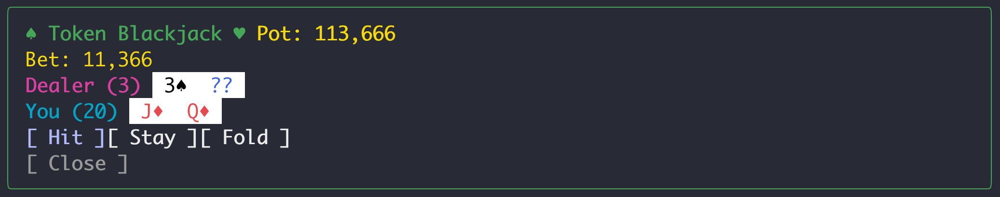

# token-blackjack

A Claude Code mod: play blackjack with the tokens you use.

Tokens used by each turn go into your pot. Type `/blackjack` to open a table above the prompt, bet 10%, 50% or ALL IN of your pot, then Hit, Stay or Fold. Wins pay 1:1 (blackjack 3:2), a fold costs half your bet.



Install:

```
/plugin marketplace add richardhartme/token-blackjack
/plugin install token-blackjack@token-blackjack
```
